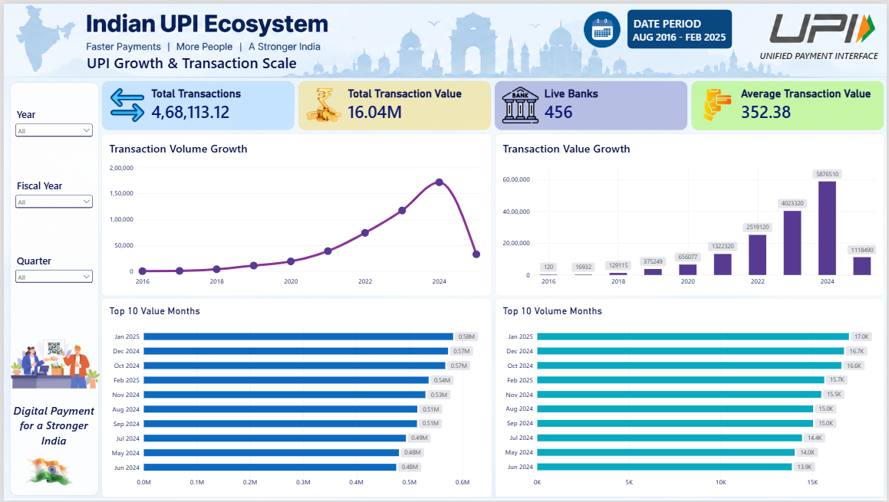
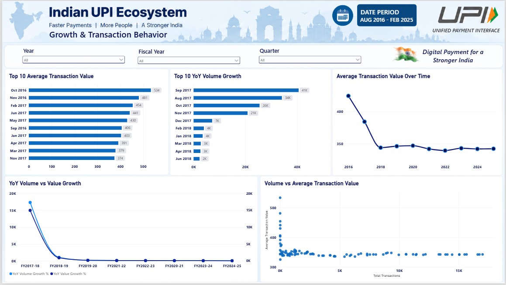
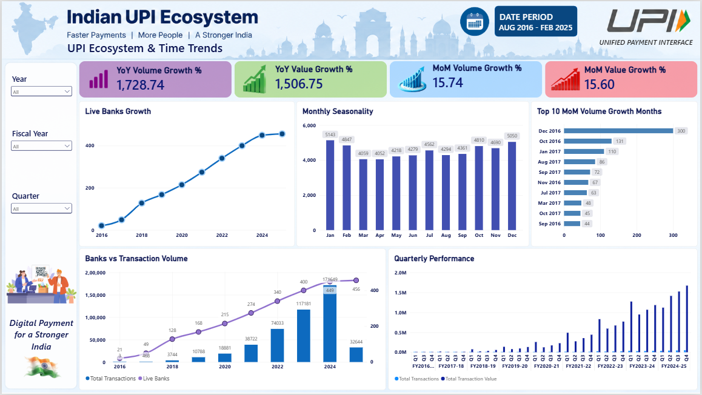

# 📊 UPI Transaction Analytics & Growth Dashboard

An end-to-end Data Analytics project analyzing the growth and evolution of India's UPI ecosystem from **August 2016 to February 2025** using **PostgreSQL, Power BI, and Excel**.

### 🛠️ Tools
- PostgreSQL — SQL analysis
- Excel — Data cleaning & validation
- Power BI — Dashboard & visualization

### 📌 Key Analysis
- Transaction volume & value growth
- YoY & MoM growth analysis
- Average transaction value
- Top transaction months
- Live bank participation
- Monthly seasonality
- Quarterly performance
- Transaction volume vs average transaction value

---

## 📊 Power BI Dashboard

### Page 1 — UPI Growth & Transaction Scale

### Page 2 — UPI Growth & Transaction Behaviour

### Page 3 — UPI Ecosystem & Time Trends

---

## 📂 Project Files

- [SQL Analysis](SQL-analysis-queries.sql)
- [Power BI Dashboard](UPI_Analysis_Dashboard.pbix)
- [Project Documentation](documentation.docx)
- [DAX Mesures Formulas](DAXMeasures.txt)
## 📚 Dataset

**Indian UPI Ecosystem Statistics 2016–2025**  
Source: [Kaggle](https://www.kaggle.com/datasets/vedantagarwal0812/indian-upi-ecosystem-statistics-2016-2025)

## 🔗 Connect

**LinkedIn:** [View Project Showcase](YOUR_LINKEDIN_POST_URL)

---

### 👩‍💻 Author

**Arundhuti Mukhopadhyay**  
B.Tech CSE | Aspiring Data Analyst
